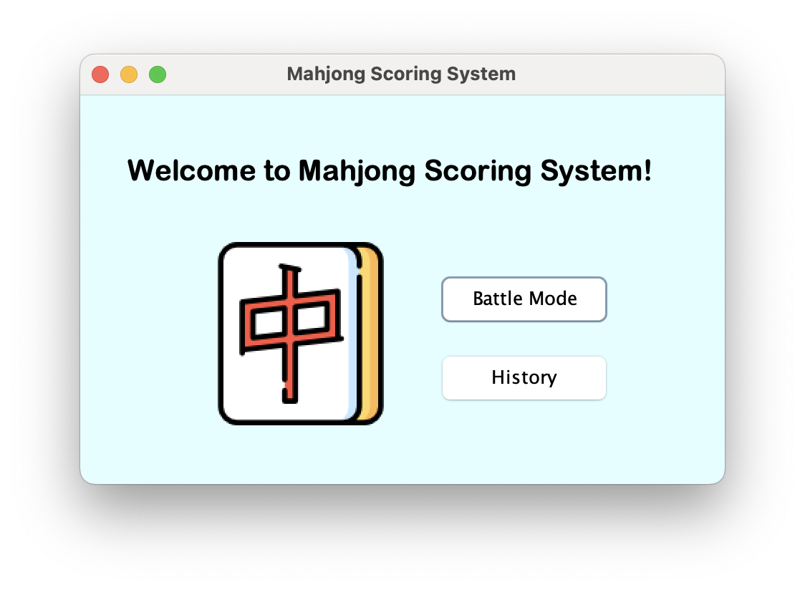
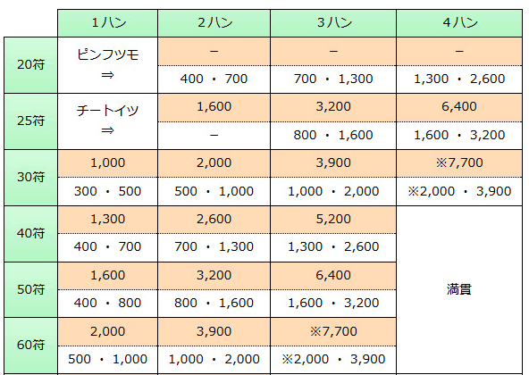
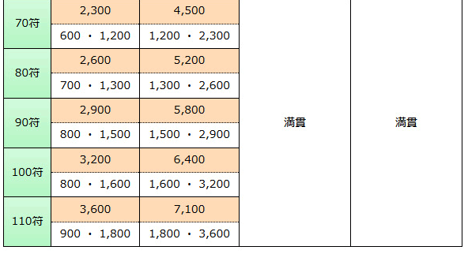
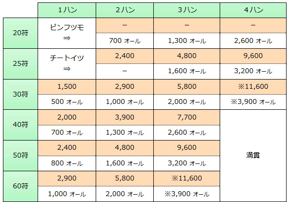
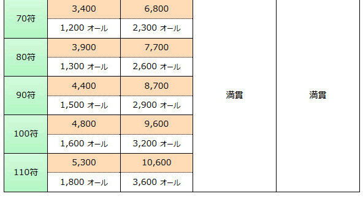
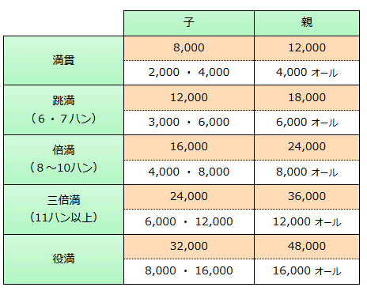

# Mahjong

This is the final project for the NTU 2020 Fall Object-Oriented Programming Language (OOP) course: a Mahjong score calculator with user-friendly UI design and history display functions.

## Points Reference Table

### Player

### Banker

### Full House or Better

## Reference

1. https://zh.wikipedia.org/zh-tw/日本麻將計分方法
2. https://mahjong.fandom.com/zh/wiki/日本麻雀計分方法?variant=zh-tw
3. https://home.gamer.com.tw/creationDetail.php?sn=4376711